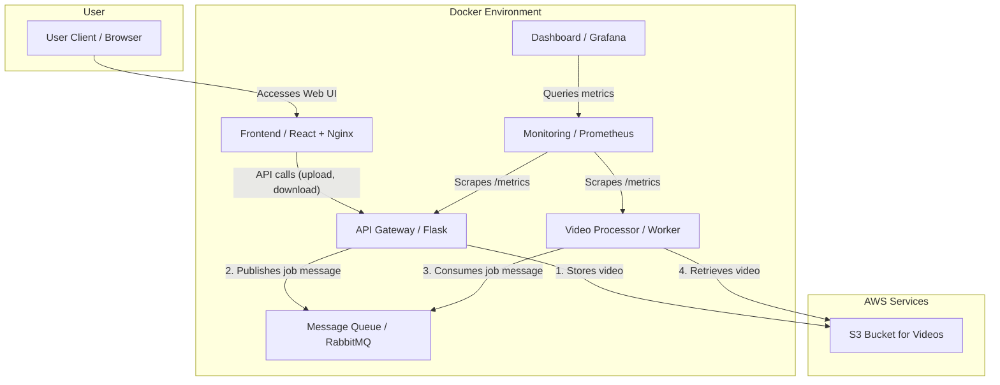

Here’s your README rewritten in **proper markdown format**, structured for clarity, and optimized for tools like **GitHub Copilot** and documentation parsers:

---

# 📹 Production-Ready Monitoring Lab: A Complex Video Processing Pipeline

This project simulates a **realistic, asynchronous video processing pipeline** to teach and demonstrate **production-level monitoring techniques**. It features **multiple microservices** and showcases how to monitor not just individual services, but **end-to-end system performance**.

---

## 🏗️ Architecture Overview

The system uses **Docker Compose** to orchestrate several services:

* **Frontend**: Modern React web application for video upload and management
* **API Gateway**: Receives video uploads, stores in **S3**, and sends jobs to **RabbitMQ**.
* **Worker**: Consumes jobs, processes videos, updates the database.
* **Prometheus**: Scrapes metrics from services.
* **Grafana**: Visualizes those metrics.



---

## 🛠️ Technology Stack

| Category       | Tools Used                              |
| -------------- | --------------------------------------- |
| **Frontend**   | React 18, Tailwind CSS, Nginx          |
| **Backend**    | Python (Flask)                         |
| **Queue**      | RabbitMQ                               |
| **Containers** | Docker, Docker Compose                 |
| **Monitoring** | Prometheus, Grafana                    |
| **Cloud**      | AWS (EC2 for compute, S3 for storage) |
| **CI/CD**      | GitHub Actions, Bash Scripts (optional)|

---

## 🎯 Core Metrics Monitored

| **Category**           | **Key Metrics**                                           | **Services** | **Why It Matters**                                     |
| ---------------------- | --------------------------------------------------------- | ------------ | ------------------------------------------------------ |
| **System Throughput**  | `api_uploads_total`, `worker_jobs_processed_total`        | API, Worker  | Measures how much work is being processed end-to-end.  |
| **Queue Health**       | Queue depth, ready messages                               | RabbitMQ     | Detects backlogs—critical for async pipelines.         |
| **Processing Latency** | `worker_processing_time_seconds` (histogram)              | Worker       | Monitor job duration. p95/p99 latency is key for SLOs. |
| **Error Rates**        | `api_upload_failures_total`, `worker_jobs_failed_total`   | API, Worker  | Critical for alerting and RCA.                         |
| **Resource Usage**     | CPU, Memory, Disk I/O (via `node_exporter` or CloudWatch) | EC2          | Infrastructure health monitoring.                      |

---

## 🚀 Getting Started (Local Setup)

### ✅ Prerequisites

* Docker installed and running.
* AWS S3 bucket created.
* AWS credentials configured (e.g., `~/.aws/credentials`).

### 📦 Clone and Configure

```bash
git clone https://github.com/your-username/complex-video-project.git
cd complex-video-project
touch .env
```

Add your S3 bucket name in `.env`:

```env
S3_BUCKET=your-unique-s3-bucket-name
```

### ▶️ Run the Stack

```bash
./scripts/deploy.sh
```

### 🌐 Access Services

| Service        | URL                                              | Credentials       | Description                    |
| -------------- | ------------------------------------------------ | ----------------- | ------------------------------ |
| **Frontend**   | [http://localhost:3001](http://localhost:3001)  | -                 | Modern React web interface    |
| **API**        | [http://localhost:5001](http://localhost:5001)  | -                 | REST API endpoints            |
| **RabbitMQ**   | [http://localhost:15672](http://localhost:15672)| `guest` / `guest` | Message queue management      |
| **Prometheus** | [http://localhost:9090](http://localhost:9090)  | -                 | Metrics collection & querying |
| **Grafana**    | [http://localhost:3000](http://localhost:3000)  | `admin` / `admin` | Metrics visualization         |

---

## ☁️ AWS Deployment

### 🛠️ Provision EC2 Infrastructure

Run from your **local machine**:

```bash
./scripts/provision_infra.sh
```

### 🔐 SSH into EC2 & Install Tools

```bash
ssh ec2-user@<your-ec2-ip>

sudo yum update -y
sudo yum install -y git docker
sudo systemctl start docker
sudo usermod -aG docker ec2-user
# Re-login to apply Docker group changes
```

### 🚀 Deploy App on EC2

```bash
git clone https://github.com/your-username/complex-video-project.git
cd complex-video-project
./scripts/deploy.sh
```

---

## 🤖 Automation Scripts

| Script                       | Run Location | Purpose                                                 |
| ---------------------------- | ------------ | ------------------------------------------------------- |
| `scripts/provision_infra.sh` | Local        | Creates AWS EC2, SGs, IAM roles using AWS CLI           |
| `scripts/deploy.sh`          | EC2 Instance | Pulls code, rebuilds Docker containers, starts services |

---

## ⚙️ Configuration

Uses environment variables via `.env` file.

| Variable        | Description           | Used By     |
| --------------- | --------------------- | ----------- |
| `S3_BUCKET`     | AWS S3 bucket name    | API         |
| `RABBITMQ_HOST` | RabbitMQ host address | API, Worker |

---

## 📡 API Endpoints

### 📥 Upload Video

* **Endpoint**: `POST /upload`
* **Description**: Uploads a video for processing.
* **Request**: `multipart/form-data` with a `file` field.

#### Example

```bash
# Create dummy file
echo "dummy video content" > myvideo.mp4

# Upload
curl -X POST -F "file=@myvideo.mp4" http://localhost:5001/upload
```

#### Success Response

```json
{
  "status": "success",
  "filename": "myvideo.mp4"
}
```

---

Let me know if you want me to turn this into a `README.md` file or add GitHub badges, license section, or contributors section.
